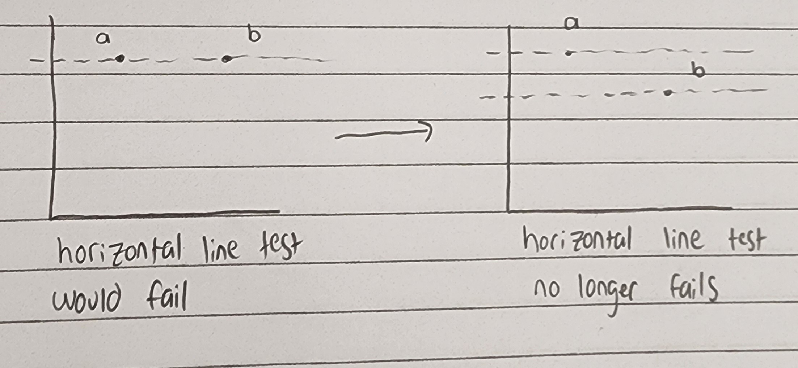
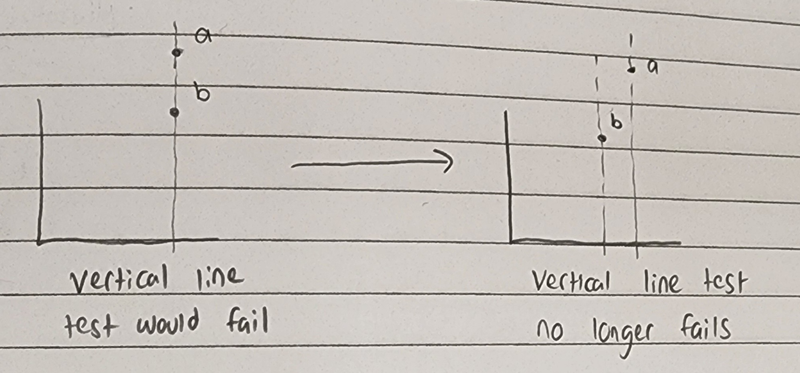

+++
title = 'Making Sense of Injectivity'
date = 2024-01-12T13:34:43-06:00
draft = false
+++

## Introduction
When I was first introduced to the idea of injectivity,
the definition felt rather arbitrary and unmotivated.
Conceptually, when a function is *injective* it means that it is *one-to-one*, or
that it maps every element in its domain to exactly one element in its codomain.

This is (and was) a clear statement, but my confusion stemed from the way that we
formalize this concept in the language of mathematics.

## Definition of injectivity
Let $f : A \rightarrow B$ be a function.
Then f is said to be **injective** if

$\forall x,y \in A,\  f(x) = f(y) \implies x = y$

For the uninitiated, this means: 
> If the outputs of $f(x)$ and $f(y)$ are the same,
> then the inputs $x$ and $y$ must also be the same.

## Why?

Why is this the particular way we've formalized the concept of *one-to-one*?

Wouldn't it be equally valid to formalize it as 
$\forall x,y \in A,\  x = y \implies f(x) = f(y)$?

But there is a problem, swapping the LHS and the RHS of the implication produces
a statement that isn't logically equivalent to the statement before swapping!

If this isn't obvious, I'll include a short argument.

Let $x,y \in A$, 
let $P$ be the statement $f(x) = f(y)$,
and let $Q$ be the statement $x = y$.

Our question becomes:
$P \implies Q \stackrel{?}{\equiv} Q \implies P$

Consider the following table of truth values:
|P|Q|$P \implies Q$|$Q \implies P$|
|-|-|:------------:|:------------:|
|F|F|T             |T             |
|F|T|T             |F             |
|T|F|F             |T             |
|T|T|T             |T             |

The above table is known as a [truth table](https://en.wikipedia.org/wiki/Truth_table).

Notice that one the left side of the table, all possible combinations of $P$ and $Q$ are
considered.

The third and forth columns tell us for which combinations of $P$ and $Q$ make that
column's statement True or False, denoted T and F, respectively.

Now, since the columns for $P \implies Q$ and $Q \implies P$ (the third and forth columns),
aren't the same for each combination of truth values for $P$ and $Q$, the statements cannot
be logically equivalent.

So if injectivity is formalized as $P \implies Q$, then formalizing it as $Q \implies P$ would
yield something that isn't describing the same concept. **But WHY NOT?!**

## Making the definition clear

I spent an embarrassingly long time trying to figure out why we formalize *one-to-one*
in this way instead of with the swapped LHS/RHS statement.

It turns out that there is a simple reason that explains why we can't formalize it
with a swapped LHS and RHS, and once I figured it out
I felt quite dumb for not seeing it immediately.

Consider the following picture

The graph on the left represents $f(x) = f(y) \wedge x \neq y$.
This would violate the statement that our function is injective,
i.e. that $f(x) = f(y) \implies x = y$. So we force our function to
be injective by making the two values $f(x)$ and $f(y)$ different from each other.

So what does the swapped LHS/RHS statement $x = y \implies f(x) = f(y)$ look like?

The graph on the left shows $f(x) \neq f(y) \wedge x = y$. So we force our function to
seperate, just as we did above, to satisfy the statement
$f(x) \neq f(y) \implies x \neq y$, which is logically equivalent
to the contrapositive, $x = y \implies f(x) = f(y)$.

Looking at both of these images, it is clear that if we want a function to be one to one,
that **both** statements must be true!
i.e. that $(f(x) = f(y) \implies x = y) \wedge (x = y \implies f(x) = f(y))$.

So why does the definition of injectivity seem to be missing the second half?

Well, the comments below the graphs in the second image kind of give the game away.
The key here is to notice that our statement
$x = y \implies f(x) = f(y)$, when sketched, 
looks earily similar to the requirement that all functions must pass what is known
as the *vertical line test*.

## The reason

Let's look back at the definition for injectivity:

>Let $f : A \rightarrow B$ be a function.
>Then f is said to be **injective** if
>
>$\forall x,y \in A,\  f(x) = f(y) \implies x = y$

The missing piece, $x = y \implies f(x) = f(y)$, is hidden in the first line when
we state that f is a **function**.

Since all functions pass the vertical line test (that's indeed what it means to be a function)
every function already satisfies this missing piece.

Hence, when we define the injectivity of functions, it is redundant to state that
$\forall x,y \in A,\ x = y \implies f(x) = f(y)$ must also be satisfied, because
the only way it wouldn't be is if f wasn't a function, which it is!

## Conclusion

### Definition of injectivity
Let $f : A \rightarrow B$ be a function.

Then f is said to be **injective** if

$\forall x,y \in A,\  f(x) = f(y) \implies x = y$

### Definition of function
Let $f$ be a relation between the sets $A$ and $B$.

Then f is said to be a **function**, and is denoted by $f : A \rightarrow B$, if

$\forall x,y \in A,\ x = y \implies f(x) = f(y)$

I tried to walk readers through my thought process as fresh undergrad trying to figure
out this definition and why it is the way it is. For some reason, this was never explained
to me clearly. Maybe it was one of those things I missed back in highschool, maybe it was
so obvious to everyone else that the professors at UTD didn't feel the need to elaborate, but
I never once had anyone compare these two definitions side by side and explain how the
combination of the two requirements is what yields the *one-to-one* property. 

Moreover, many of my peers can't give me straight answers w.r.t. why injectivity is defined
this way and not some other way, which I think reflects just as poorly on the education
system as it does on these students for not more thinking critically about the way we
formalize these concepts.
