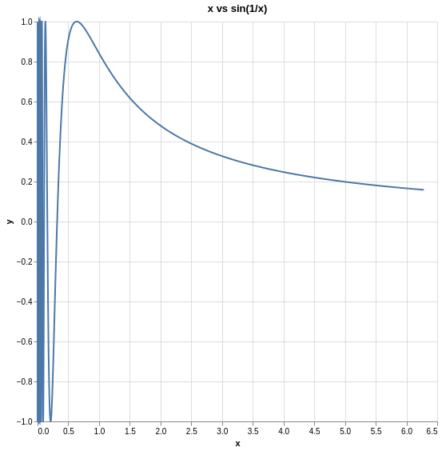
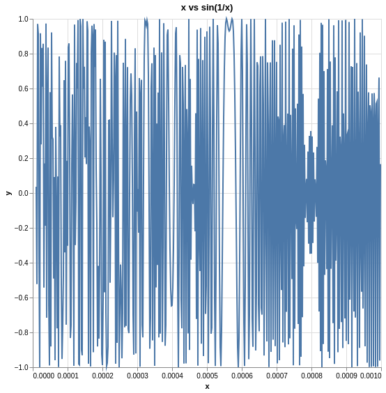
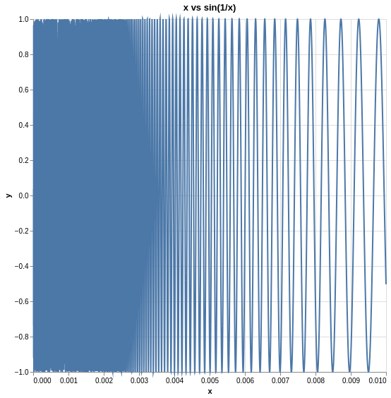
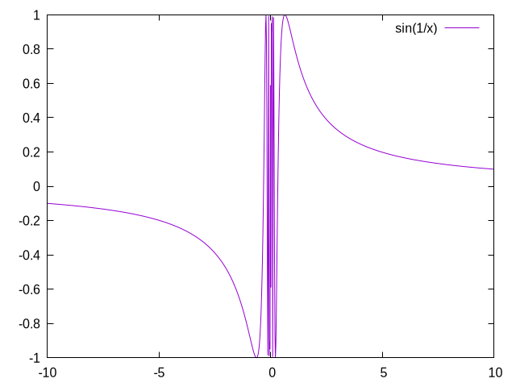
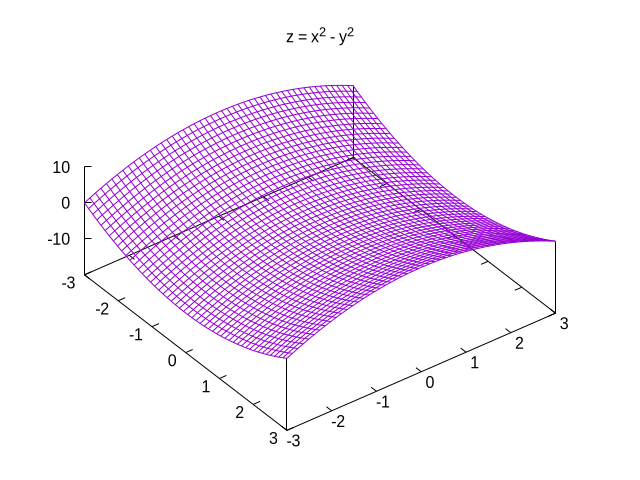

+++
title = 'Programmatic Math Visualizations'
date = 2024-01-14T17:34:03-06:00
draft = false
+++

## Introduction

When studying math, I always try to find good geometric intuitions for whatever
concept I'm trying to learn. It's not always possible, especially when dealing
with higher-dimensional spaces, but when you can create simple, concrete examples
in easier-to-visualize spaces, the intuition you gain makes the generalized
form much more clear.

In this post I want to discuss some tools I use to play around with the
concepts from my lectures and visualize what's happening.

## Plotting Libraries

My favorite programming language is [Common Lisp](https://common-lisp.net/).
It's an extremely flexible language that lets me do what I want to
do *exactly* how I want to do it. More importantly, it's just a lot of fun to write code with.

In this post I'll be showing three libraries I use regularly, namely,
- ls-stat/plot (Common Lisp)
- eazy-gnuplot (Common Lisp)
- Manim CE (Python)

The third library was originally developed by 
[3Blue1Brown](https://www.3blue1brown.com/), a well-known math youtuber,
and is written in Python. I haven't got around to creating a nice set of
bindings to this library for Common Lisp, so when using this library I
still use Python like everyone else. Maybe if my professors ease up on the
homework this semester I'll have time to do a full rewrite of the library
in Common Lisp, but I doubt this will happen anytime soon.

I'll assume you know the basics of Common Lisp for the first two libraries. 

## ls-stat/plot

Documentation for this library can be found 
[here](https://lisp-stat.dev/docs/tutorials/plotting/).

This was the first plotting library I used, and I still use it whenever
I want to graph something in $\mathbf{R}^2$.

### Getting Started

```common-lisp
(ql:quickload :lisp-stat)
(in-package :ls-user)
(ql:quickload :plot/vega)
```

### Example Usage

The first example we'll consider is plotting the function $\sin(\frac{1}{x})$.
I first came across this weird function in my Analysis II course, where we
talked about how it oscillates infinitely in an $\varepsilon$-neighborhood
about the origin. No matter how small of a region around the origin you try
to restrict yourself to, it'll always have infinitely many oscillations in
$[-\varepsilon, \varepsilon]$ for your choice of $\varepsilon \in \mathbf{R}^+$.
Weird, right?

In any case, let's plot the thing.



```common-lisp
(let* ((x-values (loop for x from 0.0001 to (* 2 pi) by 0.00001 collect x)) ;; (1)
       (y-values (mapcar (lambda (x)
                           (sin (/ 1 x)))
                         (x-values)))                                       ;; (2)
       (data (plist-df `(:x ,(coerce x-values 'vector)
                         :y ,(coerce y-values 'vector)))))                  ;; (3)
  (plot:plot
    (vega:defplot sin-of-one-over-x-plot
      `(:title "x vs. sin(x)/x")                                            ;; (4)
        :data ,data
        :mark :line
        :width 500
        :height 500
        :encoding (:x (:field :x :type :quantitative)
                   :y (:field :y :type :quantitative)))))
```
(1) - We are interested in seeing what happens close to the origin, so we collect some
evenly spaced values from the interval $[0.0001, 2\pi]$. Notice that we exclude 0 as
$1/0$ is undefined (recall that $\forall x \in \mathbf{R},\ 0x \neq 1). The
[loop macro](https://gigamonkeys.com/book/loop-for-black-belts) makes it easy to collect
a bunch of numbers into a list. This list is bound to the symbol x-values within the let*
macro.

(2) - We map the function $\sin(\frac{1}{x})$ over this list, collecting the results into a list of
its own, and again bind the symbol y-values to it locally.

(3) - plist-df is a function that takes as input something called a plist. A plist is
just Lisp lingo for a linked list where the elements of said list alternate in the pattern
(:key1 value1 :key2 value2 ...). Basically a slow dictonary. Since the plist-df expects
our values to be vectors and the symbols x-values and y-values are bound to lists, we
first coerce them both to vectors. The result of this function is a dataframe, which is 
a custom data type used in ls-stat/plot that we eventually pass to the plotter.

(3) $\wedge$ (4) - You may have noticed the weird \` symbol and some seemingly random
commas in these two sections of the code. This changes
how the common lisp interpreter interpretes the symbols within it. Lisp has a regular mode
where lists of the form (f x y z) are interpreted to mean "call the function f with the
pre-evaluated arguments x, y, and z". In this mode, if we want the interpreter to keep
a list unevalutated (maybe we'd like to symbolically manipulate the list, for example), we'd
have to quote it. However, in the mode introduced by the \` symbol, the opposite happens.
In this special mode, all symbols are left in their symbolic form unless proceeded by a comma,
which forces their evaluation. I wanted to point this out as it's a little strange looking.
If you want to learn more about this, check out [this article](https://cl-cookbook.sourceforge.net/macros.html)
that talks a little bit about macros and the \` (the backquote facility).

Zooming in a little bit to $[0.00001, 0.001]$, we get the sense that, as we get closer and
closer to the origin, the oscillations get more and more dense.


The plotting isn't perfect. And if you were just looking at these static images you may
conclude that there's "pockets" of density at arbitrary sections of the graph. But the
power of being able to throw together hacky plots like this is that you can play around
with it, generating a bunch of graphs for a bunch of different neighborhoods. By doing so,
it's pretty easy to tell when something's an artifact of taking discrete points and when
it's really how the graph looks. 

Let's look at one more to demonstrate this.
Expanding our interval to $[0.00001, 0.01]$, we see the true nature of the function.



Ah ha! It does seem to get more and more dense as we get closer to the origin after all!

Notice that in the previous graph we considered the interval $[0.00001, 0.001]$ and this
time we considered the interval $[0.00001, 0.001]$. I'm showing this to make clear
that you need to play around with the size of the intervals you're graphing and
the density of points in those intervals. Because we use discrete points to graph things
on a computer, a lot of weird artifacts can appear. This isn't a problem if you play
around with it, but if you just generate one graph and spend a lot of time trying to understand
it, you may be under a false impression w.r.t. its true nature.


## eazy-gnuplot

Documentation for eazy-gnuplot can be found 
[here](https://guicho271828.github.io/eazy-gnuplot/).

What I like about this library is that it's just a set of bindings to the
well-known plotting framework [gnuplot](http://www.gnuplot.info/). So while the
above documentation may not be very complete, there is a ton of resources for
learning the underlying library gnuplot which is very easy to translate to
eazy-gnuplot.

What I don't like is that it requires a lot more boilerplate than ls-stat/plot,
but we can easily plot 3-dimensional things with it unlike with ls-stat/plot.

eazy-gnuplot (and as such gnuplot itself) generate png images of your graphs and
throw them in a local directory ./images. What does this mean? If the current working
directory of the process running your code is ., then the subdirectory called images
is where gnuplot will store your generated graphs.

This is different then ls-stat/plot, which uses vega-lite under the hood, which uses
a browser engine like chrome to render your images.

Thus, after gnuplot generates your images, you still have to open them.
Never fear, I have a little helper function which makes the workflow just as nice.

### Getting Started
First, make sure you have gnuplot somewhere in your [$PATH](https://www.linfo.org/path_env_var.html).
On Gentoo, run

```bash 
sudo emerge -av sci-visualization/gnuplot
```

You'll also need some sort of image viewer launchable from the terminal.
I like [feh](https://wiki.gentoo.org/wiki/Feh).
To install feh on Gentoo, run

```bash
sudo emerge -av media-gfx/feh
```

Then you'll need to install the eazy-gnuplot library.

```common-lisp
(ql:quickload :eazy-gnuplot :clml.statistics :clml.utility)
(use-package :eazy-gnuplot)
```

### Example Usage
Let's revisit our friend $\sin(\frac{1}{x})$ using this new library.

First, we define a helper function called png-from-file which will open the png file of
the graph generated by eazy-gnuplot
```common-lisp
(defun png-from-file (f)
  (uiop:run-program (list "feh" f) :output t
```

Now, it's time to plot!
```common-lisp
(define plot-sin-of-one-over-x (output)
  (with-plots (s :debug nil)
    (gp-setup :terminal '(pngcairo) :output output)
    (gp :set :samples 1000)
    (plot "sin(1/x)"))
  output)

;; Using our helper function...
(png-from-file (plot-sin-of-one-over-x "images/function-plot.png"))
```

The above code opens up the following image in feh.


Very pretty, but we've spent a lot of time on $\sin(\frac{1}{x})$. Let's move on to some
3-dimensional graph visualizations.

I like saddle surfaces, let's plot one!

```common-lisp
(defun plot-saddle-surface (output)
  (with-plots (s :debug nil)
    (gp-setup :output output :terminal '(pngcairo))
    (gp-unset :key)
    (gp :set :isosamples 50)
    (gp :set :title "z = x^2 - y^2") ;; you can put latex in the title!
    (gp :set :xrange '(-3 3))
    (gp :set :yrange '(-3 3))
    (gp :set :view '(29 53)) ;; phi = 53 degrees, theta = 29 degrees defines our viewpoint
    (splot "x**2 - y**2")
    (format s "~%replot~%")) ;; format is printf for common lisp
  output)
(png-from-file (plot-saddle-surface "images/gnuplot-saddle-surface.png"))
```



## Manim CE

Documentation for Manim CE can be found [here](https://docs.manim.community/en/stable/).

Finally, we'll look at something a little different.
This library is more like animation software than a plotting library, but since it
was designed specifically for making math animations, we can use it to create very
nice visualizations of functions, vector fields, graphs (networks not planes),
linear transformations in vector spaces, and a whole lot more.

This library uses ffmpeg to stitch together a bunch of images into a video, which
is really cool because we can create animations that zoom in for a while on an object or,
for example, see the flow of a vector field!

Unfortunately, it uses Python. This is a negative for me as I don't really like the language,
but that's a topic for another post...

### Getting Started

To set up the environment and install the manim library, run the following commands.
```bash
x=manim-playground
mkdir $x
cd $x
unset x
python -m venv env
source ./env/bin/activate
pip install manim
```
This creates a local python environment that you'll have to activate with the
```bash
source ./env/bin/activate
```
command each time.

We do this when we'd like to avoid installing libraries globally.
I always prefer to do this because I don't like having more than one package manager
operating in the global environment, and I already use Portage.

### Example Usage

#### Example: Linear Transformation in a Vector Space

```python
from manim import *

class Test(LinearTransformationScene):
    def __init__(self, **kwargs):
        LinearTransformationScene.__init__(
            self,
            include_background_plane = True,
            show_basis_vectors = True,
            i_hat_color = GREEN,
            j_hat_color = RED,
            leave_ghost_vectors = True
        )
    def construct(self):
        rotation_matrix = [[0, -1]
                           [1,  0]]
        self.wait(0.5)
        self.apply_matrix(matrix)
        self.wait(1)
```

Suppose your code is in a file named linearTransformation.py.
To create the animation, drop back to your terminal and do the following.

```bash
manim -pqh linearTransformation.py Test
```

The arguments -p tells Manim to play the video after stitching everything together and
the -qh argument stands for "quality high". You can substitute -qh for -ql which will
render the video in 480p rather than 1080p, which is good when developing a complicated
animation.



### Example: Flow of a Vector Field

```python
from manim import *

class Flow(Scene):
    def construct(self):
        plane = NumberPlane()

        func = lambda pos: ((pos[0] * UR + pos[1] * LEFT) - pos) / 3
        stream_lines = StreamLines(func)

        self.add(plane, stream_lines)
        stream_lines.start_animation(warm_up=True, flow_speed=1.5)
        self.wait(5)
```

Suppose we put that code in a file called vectorFieldFlow.py
Then we run

```bash
manim -pqh vectorFieldFlow.py Flow
```

And we get the following animation of our vector field.



I don't know about you, but to me this is super cool!
All you have to do is modify the lambda function in the above code
and you can animate the "flow" of any vector field.

This will be very helpful for animating phase spaces in
my upcoming PDEs course this semester. I wish I knew about this
back when I took ODEs.

### Example: Saddle Surface in $\mathbf{R}^3$

```python
class Saddle(ThreeDScene):
    def construct(self):
        axes = ThreeDAxes()
        saddle = Surface(
            lambda u, v: np.array([
                u,
                v,
                u**2 - v**2
            ]),
            u_range=[-3, 3],
            v_range=[-3, 3],
            checkerboard_colors=[RED_D, RED_E],
            resolution=(15, 32)
        )
        self.renderer.camera.light_source.move_to(3*IN)
        self.set_camera_orientation(phi=70 * DEGREES, theta = 30 * DEGREES)
        self.add(axes, saddle)

        self.begin_ambient_camera_rotation(90 * DEGREES / 3, about="theta")
        self.wait(5)
        self.stop_ambient_camera_rotation(about="theta")

        self.begin_ambient_camera_rotation(90 * DEGREES / 3, about="phi")
        self.wait(7)
        self.stop_ambient_camera_rotation(about="phi")

        self.wait(1)
```

After building the animation, we get the following:


Kind of a silly example, but I think this is a lot more helpful than the simple plot
of the saddle surface we generated before using eazy-gnuplot.


## Conclusions

All of these tools can be very useful when you're playing around with problems and want
a quick-and-dirty look into their behavior.

IMO, if you study math regularly, learning how to use these sorts of tools is invaluable.
