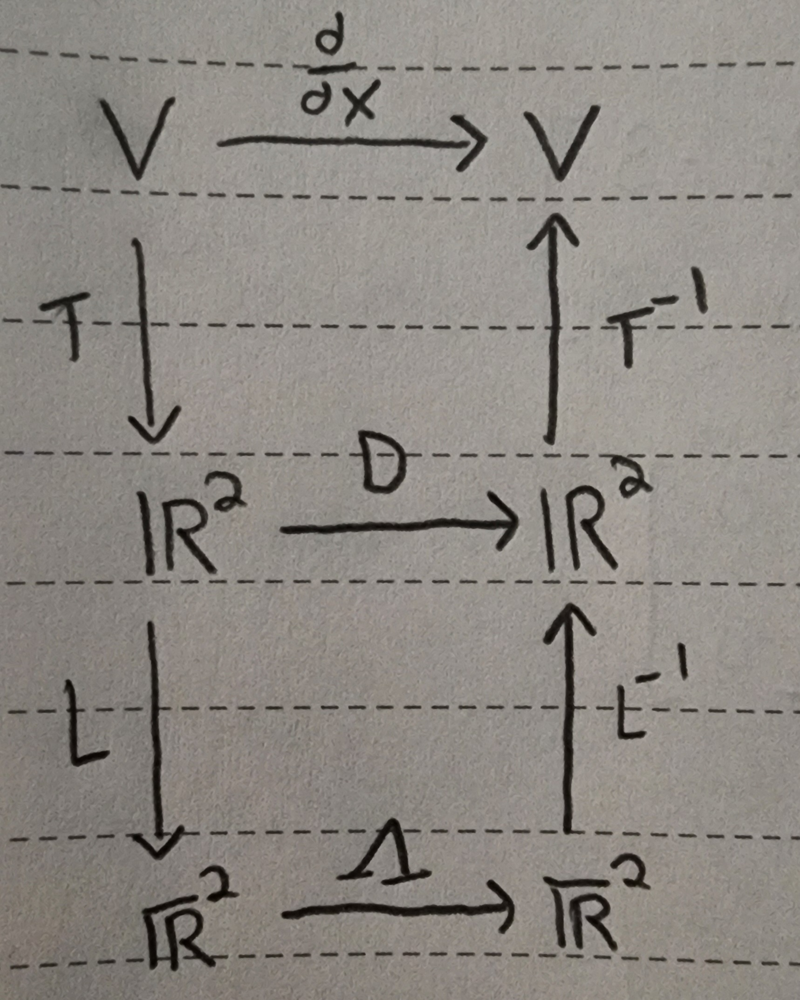

+++
title = 'Solving Calculus Problems With Linear Algebra'
date = 2024-01-21T11:26:31-06:00
draft = false
+++

## Introduction

The other day, while doom-scrolling youtube, I came across a
[video](https://youtu.be/jGP3t_17Xbg?si=fZuRJ1_RvxDnU0pa) 
from Michael Penn about finding an extremely high-order derivative
using Linear Algebra to avoid the bulk of what the work would otherwise
entail.

The problem being considered in the video was:
> Given $f(x) = e^{2x}\sin{3x}$
>
> Find $f^{(3030)}(0)$

## Solving the problem

The approach taken to solve this problem is given as follows.

Consider the following first few derivatives of f:

$f'(x) = \frac{d}{dx}[e^{2x}]\sin{3x} + \frac{d}{dx}[\sin{3x}]e^{2x}$
$ = 2e^{2x}\sin{3x} + 3e^{2x}\cos{3x}$

$f''(x)  = \frac{d}{dx}f'(x) = 2\frac{d}{dx}[e^{2x}]\sin{3x} + 2\frac{d}{dx}[\sin{3x}]e^{2x} + 3\frac{d}{dx}[e^{2x}]\cos{3x} + 3\frac{d}{dx}[\cos{3x}]e^{2x}$

$\ \ \ \ \ \ \ \ \ \ = 4e^{2x}\sin{3x} + 6e^{2x}\cos{3x} + 6e^{2x}\cos{3x} - 9e^{2x}\sin{3x}$

$\ \ \ \ \ \ \ \ \ \ = -5e^{2x}\sin{3x} + 12e^{2x}\cos{3x}$

If you don't see the pattern, do this a few more times. What you'll notice is that
all functions that can be produced by differentiation are of the form:

$ae^{2x}\sin{3x} + be^{2x}\cos{3x}$ for some $a,b \in \mathbf{R}$

Moreover, the set of all as and bs satisfying the above lie in the span of
$e^{2x}\sin{3x}$ and $e^{2x}\cos{3x}$.

So we define a vector space $V = \text{span} \\{ e^{2x}\sin{3x}, e^{2x}\cos{3x}\\}$

And we create a map called $T : V \rightarrow \mathbf{R}^2$ where $e^{2x}\sin{3x} \stackrel{T}{\mapsto}$
$ \begin{bmatrix} 1 \cr 0 \end{bmatrix}$ and
$ e^{2x}\cos{3x} \stackrel{T}{\mapsto} \begin{bmatrix} 0 \cr 1 \end{bmatrix}$.

So $(T \circ f)(x) = (1, 0) \in \mathbf{R}^2$

$(T \circ f')(x) = (2, 3) \in \mathbf{R}^2$

$(T \circ f'')(x) = (-4, 12) \in \mathbf{R}^2$

Now we want a transformation D which mimics, in $\mathbf{R}^2$, the derivative operator in $V$.

As can be seen above from choice of basis and $f'$,

$D\begin{bmatrix} 1 \\ 0 \end{bmatrix} = \begin{bmatrix} 2 \\ 3 \end{bmatrix}$

Also, $D(0, 1)$ corresponds to $\frac{d}{dx}e^{2x}\cos{3x} = 2e^{2x}\cos{3x} - 3e^{2x}\sin{3x}$
$ = -3e^{2x}\sin{3x} + 2e^{2x}\cos{3x}$

Thus, 

$D\begin{bmatrix} 0 \\ 1 \end{bmatrix} = \begin{bmatrix} -3 \\ 2 \end{bmatrix}$

Therefore, 

$D = \begin{bmatrix} 2 & -3 \\ 3 & 2 \end{bmatrix}$

is the transformation in our constructed vector space which encodes the derivative
in $\mathbf{R}^2$.

Just to verify, let's use $D$ to calculate the derivative of $f'$.

$T(f') = \begin{bmatrix} 2 \\ 3 \end{bmatrix} \in \mathbf{R}^2$

$(DT)f' = D(T(f')) = D \begin{bmatrix} 2 \\ 3 \end{bmatrix} = \begin{bmatrix} 2 & -3 \\ 3 & 2 \end{bmatrix} \begin{bmatrix} 2 \\ 3 \end{bmatrix} = \begin{bmatrix} 2(2) - 3(3) \\ 3(2) + 2(3) \end{bmatrix} = \begin{bmatrix} -5 \\ 12 \end{bmatrix}$

And

$T^{-1} \begin{bmatrix} -5 \\ 12 \end{bmatrix} = T^{-1}(-5i + 12 j) = -5e^{2x}\sin{3x} + 12e^{3x}\cos{3x} = f''(x)$

It seems to be working! Cool!

Notice that $\frac{d}{dx}^{(3030)}$ must correspond to $D^{3030}$, however, this matrix
power computation is just as hard to compute. So we'd like to map into a space where
the transformation represented by our $D$ can be written in another basis in such
a way that the transformation w.r.t. that new basis is a diagonal matrix since:

$\begin{bmatrix} a & 0 \\ 0 & b \end{bmatrix}^n = \begin{bmatrix} a^n & 0 \\ 0 & b^n \end{bmatrix}$ for any choice of $n \in \mathbf{N}$

How can we do this? By finding the eigenvectors of our matrix $D$ and doing a change
of basis to those eigenvectors!

Characteristic Equation: $\det(D - \lambda I) = 0$

$A = D - \lambda I = \begin{bmatrix} 2 - \lambda & -3 \\ 3 & 2 - \lambda \end{bmatrix}$

$\det(A) = (2 - \lambda)^2 + 9 = 0$

$\implies (2 - \lambda)^2 = -9$

$\implies 2 - \lambda = \pm 3i$

$\implies \lambda = 2 \mp 3i$

$\lambda_1 = 2 - 3i$ and $\lambda_2 = 2 + 3i$ are our eigenvalues

Using these eigenvalues, we can find eigenvectors $v_1, v_2$ as follows:

$(D - \lambda_1 I)v_1 = 0$ and $(D - \lambda_2 I)v_2 = 0$

$(D - \lambda_1 I)v_1 = \begin{bmatrix} 2 - \lambda_1 & -3 \\ 3 & 2 - \lambda_1 \end{bmatrix}v_1 = \begin{bmatrix} 3i & -3 \\ 3 & 3i \end{bmatrix}v_1 = B_1v_1 = 0$

$(D - \lambda_1 I)v_1 = \begin{bmatrix} 2 - \lambda_2 & -3 \\ 3 & 2 - \lambda_2 \end{bmatrix}v_1 = \begin{bmatrix} -3i & -3 \\ 3 & -3i \end{bmatrix}v_1 = B_2v_2 = 0$

$B_1v_1 = 0$ can be solved by gaussian elimatination and back substitution.

$B_1 \stackrel{R_2 := R_2- \frac{1/i}R_1}{\longrightarrow} \begin{bmatrix} 3i & -3 \\ 0 & -3i-\frac{3}{i} \end{bmatrix} = \begin{bmatrix} 3i & -3 \\ 0 & \frac{-3i^2-3}{i} \end{bmatrix} = \begin{bmatrix} 3i & -3 \\ 0 & -3\frac{i^2+1}{i} \end{bmatrix} = \begin{bmatrix} 3i & -3 \\ 0 & 0 \end{bmatrix} = U_1$ 

and $U_1v_1 \implies 3iv_1 - 3v_2 = 0 \implies v_1 = -iv_2$

This means there are infinite eigenvectors with eigenvalue $\lambda_1$ and
one such vector is $(1, i)$.

$B_2v_2 = 0$ can be solved the same way to get an eigenvector $(1, -i)$.
We can know this without doing the computation since complex eigenvectors come in
conjugate pairs.

We'll make a slight abuse of language for the rest of the article and say that:

$\begin{bmatrix} 1 \\ i \end{bmatrix}, \begin{bmatrix} 1 \\ -i \end{bmatrix}$

are our eigenvectors corresponding to $\lambda_1 = 2 - 3i$ and $\lambda_2 = 2 + 3i$, respectively.
Notice that we are abusing language here by talking about *the* eigenvectors despite
the fact that each eigenvalue has an infinite family of eigenvectors.

Now, we'd like a transformation $L : \mathbf{R}^2 \rightarrow \overline{\mathbf{R}}^2$ where $(1, i) \stackrel{L}{\mapsto} (1, 0) $ 
and $(1, -i) \stackrel{L}{\mapsto} (0, 1)$.

This map's inverse, $L^{-1}$, is clearly:

$L^{-1} = \begin{bmatrix} 1 & 1 \\ i & -i \end{bmatrix}$

Q: Why is this map $L^{-1}$ and not $L$?

I struggled with this for a while, causing me to finish this post with a wrong answer
two seperate times. The key to understanding this is to realize the above linear map
transforms the basis vectors in $\overline{\mathbf{R}}^2$ into eigenvectors in
$\mathbf{R}^2$.

Finally, its inverse ($L$) can be found with the 2-by-2 inverse formula:

$\det \begin{bmatrix} a & b \\ c & d \end{bmatrix} = \frac{1}{\det \begin{bmatrix} a & b \\ c & d \end{bmatrix}} \begin{bmatrix} d & -b \\ -c & a \end{bmatrix}$

Thus, 

$L = \frac{1}{-i - i} \begin{bmatrix} -i & -1 \\ -i & 1 \end{bmatrix} = \frac{i}{2} \begin{bmatrix} -i & -1 \\ -i & 1 \end{bmatrix} = \begin{bmatrix} \frac{1}{2} & \frac{-i}{2} \\ \frac{1}{2} & \frac{i}{2} \end{bmatrix}$

is our inverse transformation from $\overline{\mathbf{R}}^2$ to $\mathbf{R}^2$.

Now, the natural question to ask is: *How do we encode D in this eigenbasis?*

Let's call this encoding $\overline{D}$ for now.

Notice, the easiest way to find this encoded D in $\overline{\mathbf{R}}^2$, is
to simply use D itself.

i.e. by going back to $\mathbf{R}^2$ from $\overline{\mathbf{R}}^2$ by $L^{-1}$, 
apply $D$ to get the derivative in $\mathbf{R}^2$,
and finally go to $\overline{\mathbf{R}}^2$ via $L$.

This looks like: $\overline{D} = L D L^{-1}$.

Since we have $L$, $L^{-1}$, and $D$, we could just do this matrix multiplication
to get our $\overline{\mathbf{R}}^2$, however, there's an easier way. (It's also
important to note that we would like to keep the matrices seperate as it will
later allow us to use the special form of a matrix power for a diagonal matrix).

Notice, that $\overline{D} = L D L^{-1} \iff D = L^{-1} \overline{D} L$.

Since L is our matrix of eigenvectors, $\overline{D} = \Lambda$ where $\Lambda$ is our matrix
of eigenvalues along the diagonal in the order $\lambda_2, \lambda_1$ since we switched them around
when constructing our map L.

Hence, $D = L^{-1} \Lambda L$ where

$\Lambda = \begin{bmatrix} \lambda_2 & 0 \\ 0 & \lambda_1 \end{bmatrix} = \begin{bmatrix} 2 + 3i & 0 \\ 0 & 2 - 3i \end{bmatrix}$.

This is awesome. We're very close to the finish line now.

The last problem we must deal with is the fact that $D^n = (L^{-1} \Lambda L)^n$.

This one is rather simple. Notice that:

$(L^{-1} \Lambda L)^n = (L^{-1} \Lambda L)(L^{-1} \Lambda L)(L^{-1} \Lambda L)...(L^{-1} \Lambda L)$ n times

Using the property of associativity of matrix multiplication, we can regroup these terms.

$(L^{-1} \Lambda L)(L^{-1} \Lambda L)(L^{-1} \Lambda L)...(L^{-1} \Lambda L) = L^{-1} \Lambda (LL^{-1}) \Lambda (LL^{-1}) ... \Lambda (LL^{-1}) L = L^{-1} \Lambda I \Lambda I \Lambda I ... \Lambda I L$ n times.

which, by the fact that $I$ is the multiplicative identity, yields $L^{-1} \Lambda^n L$.

Thus, $(L^{-1} \Lambda L)^n = L^{-1} \Lambda^n L$.
and we finally get our simplified derivative $D^n = L^{-1} \Lambda^n L$

## The Big Picture

The above picture is what is known as a *commutative diagram*.
What it shows is the path you must take to traverse the spaces we constructed
in the last section.

For example, given some $g \in V$, we can find it's derivative by:

- $g' = T^{-1} D T g$
- or $g' = T^{-1} L^{-1} \Lambda L T g$
- or even $g' = T^{-1} L^{-1} \Lambda L D^{-1} L^{-1} \Lambda L T g$, but this is a silly path.

Remark: It should be noted that these "paths" are to be read right-to-left as the
multiplication of linear maps is function composition. 

## Getting the Answer

The problem asked:
> Given $f(x) = e^{2x}\sin{3x}$
>
> Find $f^{(3030)}(0)$

And by the work we did in the previous section, we have that $\frac{d^n}{dx^n} = (T^{-1} D T)^n = (T^{-1} L^{-1} \Lambda L T)^n = T^{-1} L^{-1} \Lambda^n L T$ is our nth derivative operator.

So let's apply the given function $f(x)$ to this giant operator.

$f^{(3030)}(x) = T^{-1} L^{-1} \Lambda^{3030} L T f(x) = T^{-1} L^{-1} \Lambda^{3030} L T (e^{2x}\sin{3x}) = T^{-1} L^{-1} \Lambda^{3030} L (1, 0)$

$ = T^{-1} L^{-1} \begin{bmatrix} 2 - 3i & 0 \\ 0 & 2 + 3i \end{bmatrix}^{3030} \begin{bmatrix} \frac{1}{2} & \frac{-i}{2} \\ \frac{1}{2} & \frac{i}{2} \end{bmatrix} \begin{bmatrix} 1 \\ 0 \end{bmatrix}$

$ = T^{-1} L^{-1} \begin{bmatrix} 2 - 3i & 0 \\ 0 & 2 + 3i \end{bmatrix}^{3030} \begin{bmatrix} \frac{1}{2} \\ \frac{1}{2} \end{bmatrix}$

$ = T^{-1} L^{-1} \begin{bmatrix} (2 - 3i)^{3030} & 0 \\ 0 & (2 + 3i)^{3030} \end{bmatrix} \begin{bmatrix} \frac{1}{2} \\ \frac{1}{2} \end{bmatrix}$

$ = T^{-1} L^{-1} \begin{bmatrix} \frac{1}{2}(2 - 3i)^{3030} \\ \frac{1}{2}(2 + 3i)^{3030} \end{bmatrix}$

$ = T^{-1} \begin{bmatrix} 1 & 1 \\ i & -i \end{bmatrix} \begin{bmatrix} \frac{1}{2}(2 - 3i)^{3030} \\ \frac{1}{2}(2 + 3i)^{3030} \end{bmatrix}$

$ = T^{-1} \begin{bmatrix} \frac{1}{2} (2 - 3i)^{3030} + \frac{1}{2}(2 + 3i)^{3030} \\ \frac{i}{2}(2 - 3i)^{3030} + \frac{-i}{2}(2 + 3i)^{3030} \end{bmatrix}$

$ =  [\frac{1}{2} (2 - 3i)^{3030} + \frac{1}{2}(2 + 3i)^{3030}]e^{2x}\sin{3x} + [\frac{1}{2}(2 - 3i)^{3030} - \frac{1}{2}(2 + 3i)^{3030}]e^{2x}\cos{3x}$

$ = f^{(3030)}(x)$

Finally, we get our answer by setting $n$ to 3030 and $x$ to 0.

$f^{(3030)}(0) = [\frac{1}{2} (2 - 3i)^{3030} + \frac{1}{2}(2 + 3i)^{3030}]e^{2(0)}\sin{3(0)} + [\frac{1}{2}(2 - 3i)^{3030} - \frac{1}{2}(2 + 3i)^{3030}]e^{2(0)}\cos{3(0)}$
$ = \frac{1}{2}(2 - 3i)^{3030} - \frac{1}{2}(2 + 3i)^{3030}$.

Thus, $f^{(3030)}(0) = \frac{1}{2}(2 - 3i)^{3030} - \frac{1}{2}(2 + 3i)^{3030} \in \mathbf{R}$ is our answer.

## Conclusion

The reason this problem is so cool is that we were able to take a very computationally
hard problem and move it into a new space where it is equivalent but
computationally very easy to compute.

This is a common theme in higher-level mathematics. Often we can solve hard problems
by creating new spaces with nice properties that neatly encode our hard problem
from the original space.

Once you read through this and understand the derivation, I highly recommend
that you watch the video and try doing the problem yourself. After having watched
the video I thought I understood everything, but it wasn't until I did the problem
myself over dinner that I was able to work out some subtle misunderstandings I didn't
realize I had.

<!-- TODO: You messed up L vs. L^{-1}. basically you need to swap the two.
this is because L, being a map from R^2 to eigenbasis
transforms eigenvectors to basis vectors.
so L^{-1} should take basis vectors to the eigenvectors (what you call L here)
-->

<!-- $\implies 3iv_{1,1} - 3v_{1,2} = 0 \wedge 3v_{1,1} + 3iv_{1, 2} = 0$ -->
